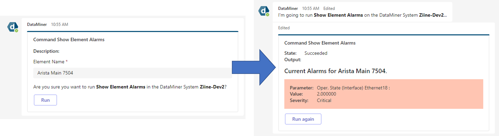

# SLC-AS-ChatOps-Alarms

This repository contains automation scripts that can help you to interact with the Alarms from your DataMiner system using the DataMiner Teams bot.

This contains the following automation scripts:

[Send Channel Notification - Alarms from Correlation](#send-channel-notification---alarms-from-correlation)

[Alarm Info](#alarm-info)

# Pre-requisites

Kindly ensure that your DataMiner system and your Microsoft Teams adhere to the pre-requisites described in [DM Docs](https://docs.dataminer.services/user-guide/Cloud_Platform/TeamsBot/Microsoft_Teams_Chat_Integration.html#server-side-prerequisites).

## Send Channel Notification - Alarms from Correlation
Automation script that implements the MS Teams bot integration to receive alarm notifications in your MS Teams Channel.

### Installation

1. Deploy the automation script from this repo to your DMS.
   - This can be done by cloning the repo and using DIS to publish in your DMS or going to the Catalog and deploy from there or use the DataMiner CICD Automation GitHub Action.

2. Create memory files in the automation scripts to easily save the Team ID and Channel ID (this can be done with PowerShell - [details here](https://learn.microsoft.com/en-us/powershell/module/teams/?view=teams-ps))

3. Create a correlation rule that triggers this automation script when the appropriated alarms are detected **or** use the examples provided in the Documentation folder of this repo.

## Alarm Info
This repository offers four automation scripts to retrieve Element and Service alarms from the DataMiner system using the DataMiner Teams bot.
- [Show Element Alarms](#Show-Element-Alarms)
- [Show Element History Alarms](#Show-Element-History-Alarms)
- [Show Service Alarms](#Show-Service-Alarms)
- [Show Service History Alarms](#Show-Service-History-Alarms)

> **Note**
> There is a known issue with the newtonsoft.json reference. After uploading the script to the DataMiner system make sure to update such reference to version 11.0.2.

### Show Element Alarms
This script retrieves the current active alarms for a specific DataMiner element. When running the below command, the chatbot asks for an element name and retrieves up to 10 active alarms, ordered by severity and then start time. 

```
run show element alarms
```



### Show Element History Alarms
This script retrieves the history alarms for a specific DataMiner element. When running the below command, the chatbot asks for an element name and retrieves up to 10 alarms from the last **6 hours**, ordered by severity and then start time. 

```
run show element history alarms
```


### Show Service Alarms
This script retrieves the current active alarms for a specific DataMiner service. When running the below command, the chatbot asks for a service name and retrieves up to 10 active alarms, ordered by severity and then start time. 

```
run show service alarms
```


### Show Service History Alarms
This script retrieves the history alarms for a specific DataMiner service. When running the below command, the chatbot asks for an service name and retrieves up to 10 alarms from the last **6 hours**, ordered by severity and then start time. 

```
run show service history alarms
```

